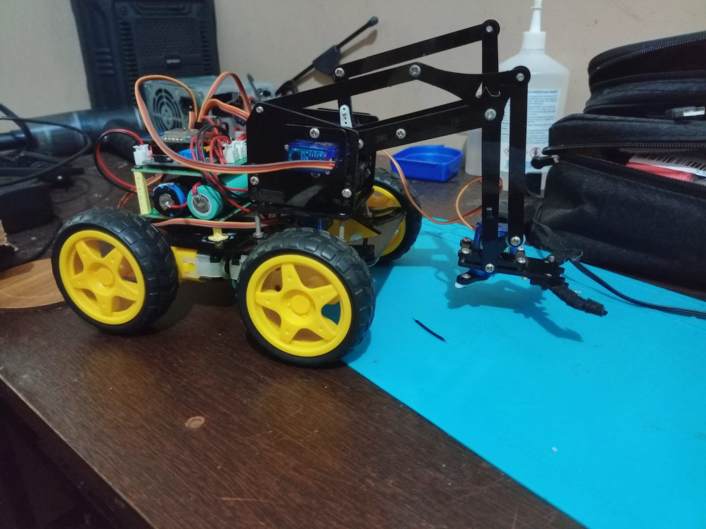
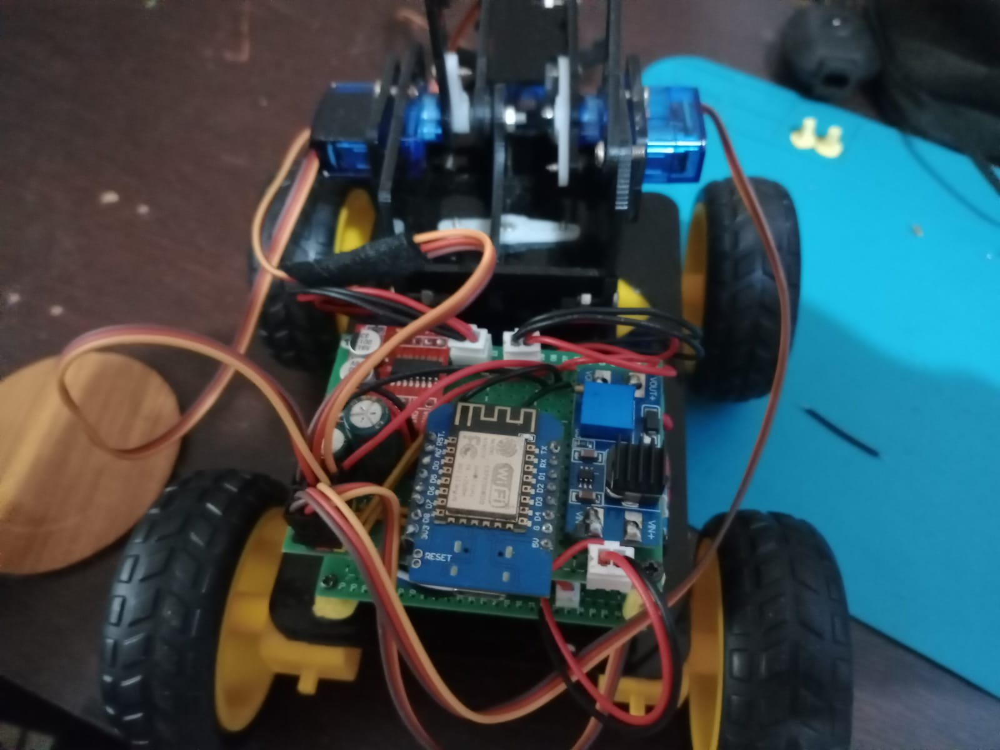

# Sistema Robótico Móvel com Comunicação UDP e RTOS

Desenvolvimento de um robô móvel equipado com um braço robótico de 4 graus de liberdade (servos SG90) e motores DC para tração. O foco do projeto foi a criação de um sistema embarcado de baixa latência com controle remoto via Wi-Fi, utilizando componentes de baixo custo.

## Ferramentas Utilizadas
  - Ambiente de Desenvolvimento: Sistema Debian com pyenv para gerenciamento isolado do Python 3.12, garantindo compatibilidade com as ferramentas de build do SDK sem interferir no sistema operacional.
  - SDK: [ESP8266_RTOS_SDK](https://docs.espressif.com/projects/esp8266-rtos-sdk/en/latest/index.html), utilizado para a programação do ESP8266 em ambiente multitarefa.

### Destaques Técnicos:

1. Firmware: Desenvolvido em C utilizando o SDK oficial da Espressif e FreeRTOS para o gerenciamento de tarefas críticas, como o servidor UDP e o controle de PWM para os motores.
  - O firmware foi construído com base nos exemplos oficiais, com customizações profundas para a integração da pilha Wi-Fi e do servidor de comandos.r UDP.

2. Protocolo de Comunicação: Implementação de sockets UDP para controle em tempo real, priorizando a baixa latência na execução de comandos manuais e automatizados.

3. Software de Controle: Interface via terminal desenvolvida em Lua para envio de pacotes de controle.
  - O sistema suporta comandos simples como stop e turnl (comandos pré-definidos), comandos diretos de movimentação (ex: M 10000 0 0 10000) ou a execução de scripts que leem sequências de comandos com delays configuráveis.

4. Hardware: Microcontrolador ESP8266 (Wemos D1).
  - Ponte H para controle dos motores DC.
  - Reguladores de tensão e baterias Li-ion.
  - Arquitetura customizada em placa perfurada (5cm x 7cm).
  - Chassi e suportes fabricados via impressão 3D (PLA).

### Amostra do projeto

